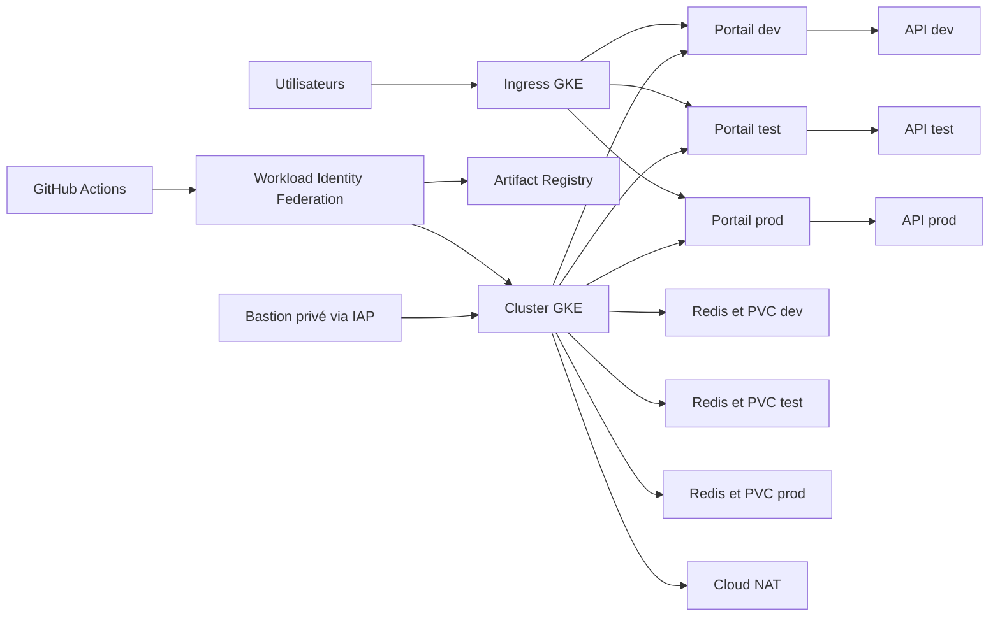

# FoodTrack — infrastructure et livraison GKE

FoodTrack est un projet de démonstration du suivi de la chaîne du froid. Ce dépôt contient l'infrastructure Google Cloud, les manifestes Kubernetes et la chaîne de livraison de l'équipe B. Une même application est déployée dans trois namespaces (`dev`, `test`, `prod`) sur un cluster GKE Standard partagé.

L'API fournie (`hello-app:2.0`) répond aux requêtes HTTP mais ne traite pas de véritables relevés de température. Le cache Redis possède un volume persistant ; il n'est pas alimenté par cette API de démonstration.

## Architecture



Le VPC utilise un sous-réseau et deux plages secondaires pour les pods et les services. Les nœuds GKE et le bastion n'ont pas d'adresse publique. Cloud NAT permet aux nœuds de télécharger les images externes. Le plan de contrôle GKE conserve un endpoint public pour les runners GitHub hébergés ; ce compromis est détaillé dans la section Sécurité.

| Élément | Configuration de l'équipe B |
| --- | --- |
| Projet | `form-gke-eleve02-618b` |
| Région / zone | `europe-west3` / `europe-west3-b` |
| Cluster / node pool | `foodtrack-b-cluster` / `foodtrack-b-pool` |
| Nœuds | 2 × `e2-standard-2`, disques `pd-standard` de 50 Go |
| Bastion | `e2-micro`, accès IAP et OS Login |
| Dépôt d'images | `foodtrack-b-images` dans Artifact Registry |
| État Terraform | Bucket GCS versionné `foodtrack-b-tfstate-form-gke-eleve02-618b` |

### Dimensionnement

Au minimum, les demandes applicatives des trois environnements totalisent environ **1,8 vCPU et 2,25 Gio de mémoire** : six portails, six réplicas API et trois caches Redis. Aux bornes maximales des HPA, elles atteignent environ **2,2 vCPU et 2,75 Gio**. Les deux nœuds offrent ensemble 4 vCPU et 8 Gio avant les réservations de GKE et des composants système. Cette marge doit être confirmée avec `kubectl describe nodes` et les métriques du cluster.

## Organisation du dépôt

| Chemin | Rôle |
| --- | --- |
| [`terraform/`](terraform/) | Racine Terraform, backend GCS et modules réseau, compute, stockage, WIF et observabilité |
| [`manifests/k8s/base/`](manifests/k8s/base/) | Ressources Kubernetes communes et StorageClass `pd-standard` |
| [`manifests/k8s/overlays/`](manifests/k8s/overlays/) | Variantes `dev`, `test` et `prod` gérées avec Kustomize |
| [`.github/workflows/ci.yml`](.github/workflows/ci.yml) | Validation, scan, plan Terraform, construction et déploiement |
| [`scripts/`](scripts/) | Santé, sauvegarde, purge, audit et redimensionnement du node pool |

## Déploiement depuis zéro

### Prérequis

- Accès autorisé au projet GCP et API nécessaires à GKE, Compute Engine, IAM, Cloud Storage, Artifact Registry, Logging et Monitoring activées.
- Terraform 1.5 ou ultérieur, Google Cloud CLI, `gke-gcloud-auth-plugin` et `kubectl`.
- Des identifiants locaux *Application Default Credentials* pour Terraform (`gcloud auth application-default login`), sans fichier d'identifiants ajouté au dépôt.
- Droits de création de l'infrastructure et accès aux paramètres des environnements GitHub Actions.
- Un seul opérateur pour les opérations `terraform apply` sur l'état partagé.

Les commandes se lancent depuis la racine du dépôt. Le bucket d'état est créé **une seule fois**, avant `terraform init` : c'est l'exception de bootstrap à la gestion par Terraform. S'il existe déjà, ne le recréez pas.

```bash
gcloud config set project form-gke-eleve02-618b
gcloud storage buckets create gs://foodtrack-b-tfstate-form-gke-eleve02-618b \
  --location=europe-west3 --uniform-bucket-level-access
gcloud storage buckets update gs://foodtrack-b-tfstate-form-gke-eleve02-618b \
  --versioning

terraform -chdir=terraform init
terraform -chdir=terraform fmt -check -recursive
terraform -chdir=terraform validate
terraform -chdir=terraform plan -var-file=dev.tfvars
terraform -chdir=terraform apply -var-file=dev.tfvars
```

Les fichiers `dev.tfvars`, `test.tfvars` et `prod.tfvars` décrivent actuellement **la même infrastructure partagée**, pas trois clusters. Les différences applicatives se trouvent dans les overlays Kubernetes. Relisez le plan avant tout `apply`, en particulier les remplacements et destructions. Le module d'observabilité utilise `portail_public_ip` : si l'Ingress reçoit une nouvelle adresse, actualisez cette variable puis appliquez à nouveau Terraform.

Récupérez l'accès au cluster et vérifiez le socle :

```bash
gcloud container clusters get-credentials foodtrack-b-cluster \
  --zone europe-west3-b --project form-gke-eleve02-618b
kubectl get nodes -o wide
kubectl apply -f manifests/k8s/base/07-storageclass-hdd.yaml
```

Configurez ensuite les environnements GitHub `development`, `test` et `production`. Chacun doit fournir ses propres secrets `INGEST_TOKEN` et `CACHE_PASSWORD`. L'environnement `production` doit exiger une approbation humaine. Le pipeline crée temporairement les fichiers `secret.env` nécessaires à Kustomize ; **ne les ajoutez jamais à Git**. Une fois l'infrastructure et ces réglages prêts, un push sur `develop` déclenche la livraison.

```bash
for ns in foodtrack-dev foodtrack-test foodtrack-prod; do
  kubectl get deploy,statefulset,svc,ingress,hpa,pvc -n "$ns"
done
kubectl get storageclass foodtrack-hdd
```

## Environnements et pipeline

| Environnement | Portails | API : bornes HPA | Seuil configuré | Niveau de journal configuré |
| --- | ---: | ---: | ---: | --- |
| `foodtrack-dev` | 1 | 1–2 | 8 °C | `debug` |
| `foodtrack-test` | 2 | 2–3 | 4 °C | `info` |
| `foodtrack-prod` | 3 | 3–5 | 4 °C | `warn` |

Ces valeurs sont déclarées dans les ConfigMaps et les overlays. L'API de démonstration ne met pas en œuvre une logique de température ; les seuils illustrent donc la séparation des configurations, pas une alerte métier effective.

Le pipeline vérifie Terraform et les manifestes rendus par Kustomize, lance Trivy, affiche un plan Terraform, puis construit l'image du **portail** étiquetée par le SHA du commit et la publie dans Artifact Registry. Sur `develop`, elle est déployée successivement en `dev`, `test` et `prod`. Chaque job attend le rollout et vérifie `/healthz` ainsi que `/api/` avec le script Python de santé. Le job `production` n'apporte une validation manuelle que si les *required reviewers* sont configurés dans GitHub.

L'image `api-capteurs` reste l'image de démonstration fournie, `hello-app:2.0` ; elle n'est pas construite par ce pipeline. Les pushes sur `main` et les tags `v*` déclenchent actuellement les contrôles et la construction, mais pas le déploiement. Une politique de release et de versionnage sémantique reste à formaliser avant de considérer ces tags comme une promotion vers la production.

### Retour arrière

Pour revenir rapidement à la révision précédente **du portail** :

```bash
kubectl rollout history deployment/portail-qualite -n foodtrack-prod
kubectl rollout undo deployment/portail-qualite -n foodtrack-prod
kubectl rollout status deployment/portail-qualite -n foodtrack-prod
```

Cette opération concerne le Deployment, pas les ConfigMaps, Secrets, volumes persistants ou changements Terraform. Elle peut être écrasée par la prochaine exécution du pipeline ; un retour durable nécessite de redéployer une version identifiée de l'image et les manifestes compatibles. Vérifiez ensuite `/healthz`, `/api/` et les logs.

## Exploitation et supervision

```bash
# Logs récents
kubectl logs -n foodtrack-prod deployment/portail-qualite --all-pods=true --since=30m
kubectl logs -n foodtrack-prod deployment/api-capteurs --all-pods=true --since=30m

# Contrôle de santé dans un terminal
kubectl port-forward -n foodtrack-prod svc/portail-qualite 8080:8080
# Dans un autre terminal
python3 scripts/healthcheck.py http://localhost:8080/api/
```

Le module Terraform d'observabilité déclare un tableau de bord, un contrôle de disponibilité du portail de production, une alerte par courriel et une métrique basée sur les logs d'erreur. Dans Cloud Logging, la requête suivante isole les erreurs du namespace de production ; enregistrez-la dans Logs Explorer pour les investigations :

```text
resource.type="k8s_container"
resource.labels.namespace_name="foodtrack-prod"
severity>=ERROR
```

Les [scripts d'exploitation](scripts/) couvrent la sauvegarde de la configuration, la purge des exports de journaux de plus de 30 jours et le redimensionnement du node pool (`off` : zéro nœud ; `on` : deux nœuds). **Le dépôt ne contient pas encore de planification automatique** de l'arrêt nocturne. Pendant un arrêt, les applications sont indisponibles, le contrôle de disponibilité peut alerter et un `terraform plan` montre temporairement l'écart avec `node_count = 2`.

## Sécurité et coûts

L'authentification du pipeline à GCP utilise Workload Identity Federation, sans clé JSON de compte de service. Les nœuds sont privés, le bastion n'a pas d'IP publique et la règle SSH FoodTrack cible le bastion depuis IAP. L'endpoint public du plan de contrôle est toutefois autorisé depuis `0.0.0.0/0` pour les runners GitHub hébergés : cette exposition doit être assumée et une alternative, telle qu'un runner privé, étudiée. L'audit de sécurité écrit couvre également l'IAM réel, les pare-feu du projet, l'historique des secrets et le résultat des scans d'images.

Les principaux postes de coût sont les deux VM du node pool, leurs disques, les PVC Redis, le bastion, les Ingress/équilibreurs, Cloud NAT, le stockage et l'observabilité. Le coût réel doit être relevé dans **GCP Billing** et comparé au calculateur officiel. À titre de dimensionnement, un arrêt de 20 h 35 à 7 h 35 ferait passer les **nœuds** de 48 à 26 nœud-heures par jour, soit environ 46 % de temps de fonctionnement en moins pour ces VM ; les autres ressources continueraient d'être facturées. Cette économie est théorique tant que l'arrêt nocturne n'est pas planifié et exécuté.

Ce dépôt est un projet de formation. Avant tout usage hors de ce cadre, revoir les droits IAM, l'exposition du plan de contrôle, la gestion des secrets, les sauvegardes et les coûts mesurés.
